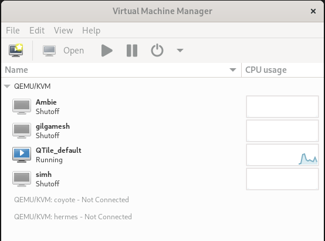
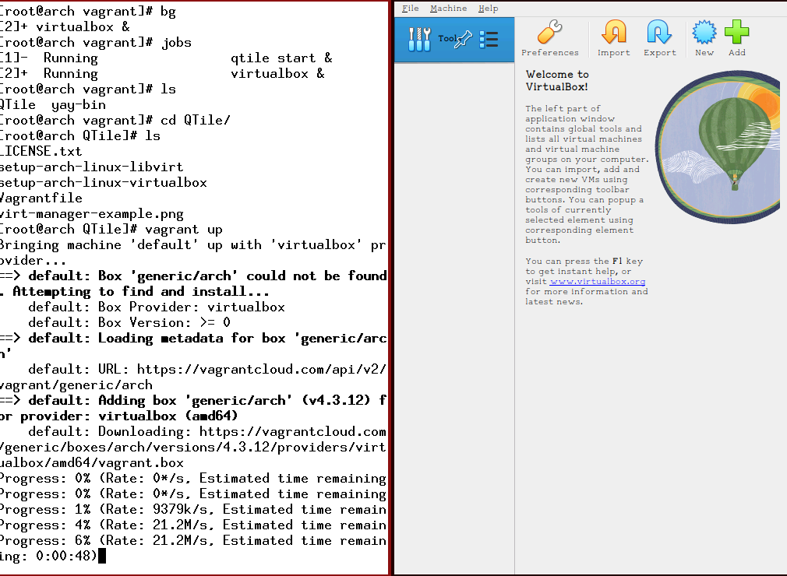

# QTile Demo

On the computer that will launch the demo there are two scripts to choose from:
* `setup-arch-linux-virtualbox`
* `setup-arch-linux-libvirt`

Those scripts are intended to configure your computer to either use VirtualBox or QEMU.

If you already have one of those installed, you may want to skip some steps to avoid re-installing software.

In that case, please read through the script to make sure all of the steps in it are taken.

Once either VirtualBox or QEMU are ready you can run Vagrant to launch the demo:

`vagrant up`

Now go to the console of the QTile demo VM that was started and:

Login as user `vagrant` password `vagrant`.

Run: `sudo xinit`

Then xterm will be running.  You can adjust the font size by holding down the `Ctrl` key and then hold down the left mouse button and choosing a font from the pop-up menu.

Position the mouse cursor over the xterm window to guide the keyboard input to it.

In the xterm window run:

`qtile start`

Ta-da, you are using QTile.

## Screenshots

This is `virt-manager` with the QTile demo VM in it:

This is Vagrant running the installation of the VirtualBox QTile demo VM:

## Video

Video of Vagrant running (12 minutes long)

